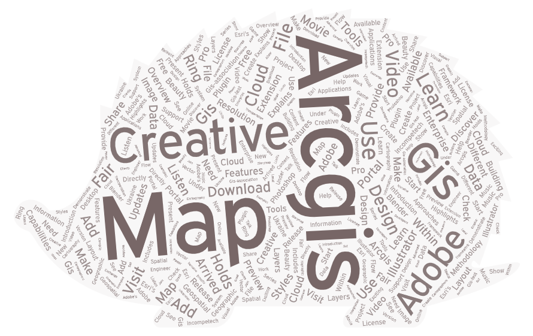

# Web Crawler Practice

## Introduction
This repository contains the deliberables for a web crawling assignment for a [graduate-level Critical GIS seminar](https://github.com/jakobzhao/geog521) led by Professor Bo Zhao. The assignment workflow can be accessed here: [https://github.com/jakobzhao/web-crawler](https://github.com/jakobzhao/web-crawler).

The first task for the assignment was to run a pre-made web crawler on Youtube. From the data collected for two searches, I constructed two word clouds, one for each search (see above and below). The next task was to develop our own web crawler for a webpage of our choice. This repository is itself the final deliverable.

This repository contains an assets folder, which features three csv files, each corresponding to the output data from a web crawler. There is also an img folder, which is home to two word clouds developed from the scraped data.

## Using the Youtube Crawler

Running the bot itself was rather straightforward; the set-up, however, was not. There appeared to be a compatibility issue with the version of ChromeDriver used by the Notebook and the version used in Google Colab by default. Turning to the Copilot AI, I was guided through an awkward series of possible issues and solutions before the root cause of the conflicting versions was identified. Copilot walked me through a reset of Chrome and ChromeDriver in Google Colab to versions that matched with one another. The whole ordeal was quite amusing, really. I was, after all, using a bot to support the development of another bot. I couldn't help but note that:

> "I am being mediated by two distinct bot entities, in an attempt to, ultimately, accomplish things more efficiently - there might be a lot to unpack there…" (Alex Kirchmeier)

As I stated above, the crawler itself ran quite well. I used two search terms: "creative GIS" and "deep mapping". I was not particularly impressed by the actual Youtube results for these search terms, but no matter. The crawler collected the video url, the user url and username, the title of the video, the number of views, the time of creation, a brief snippet of the video description, and the time of collection. The results were saved in the aforementioned csv files found under the assets folder: one for ["creative GIS"](https://github.com/AlexKirchmeier/web-crawler/blob/main/assets/ytsearch-result-creative-gis.csv.csv) and one for ["deep mapping"](https://github.com/AlexKirchmeier/web-crawler/blob/main/assets/ytsearch-result-deep-mapping.csv.csv).

I uploaded snippets of the videos' descriptions into [Word Art](https://wordart.com/), removed irrelevant terms, consolidated a few terms that had appeared separately, and played around with the resulting word cloud presentation. The word cloud for "creative GIS" can be seen above, and the word cloud for "deep mapping" can be seen below. Both word clouds are located in the img folder.

## Using the Crawler on a Different Webpage

For this portion, I was tasked with running the web crawler on a different webpage. I opted to crawl the [Guardian US homepage](https://www.theguardian.com/us), although not before naively attempting to scrape a small webpage that was relevant to my interests in deep mapping (there, I ran into robots.txt restrictions, and realized that I was engaging in unethical bot practice). The Guardian's homepage was chosen as it is a public-facing webpage with an already high volume of site traffic. In other words, this is a webpage that will not be quite as adversely affected by the infliction of bots (as, say, a personal blog) as I engage in this web crawling practice.

My intention was to scrape the titles of the articles featured on the hompage. Once I had understood the logic of the webpage's html structure, it was primarily a matter of reworking the code lines specific to the Youtube page so that they would instead fit to the new webpage. This was done through trial and error, mostly, although I will claim that my attempts were grounded in a passable understanding of what each code line accomplished. That said, my understanding of the code certainly grew from 'passable' to 'solid' as I made progress. This time, no AI assistance was requested.

The resulting web crawling code, developed in Google Colab, is available in this repository as [webcrawler.ipynb](https://github.com/AlexKirchmeier/web-crawler/blob/main/webcrawler.ipynb). The output dataframe ([theguardian.csv](https://github.com/AlexKirchmeier/web-crawler/blob/main/assets/theguardian.csv.csv)) was saved as a csv file, and can be found in the assets folder. The article titles were scraped on 4/25, at roughly 10pm PST.

## Acknowledgement

Thanks to Bo Zhao for developing this project workflow. The walkthrough can be found here: [https://github.com/jakobzhao/web-crawler](https://github.com/jakobzhao/web-crawler).